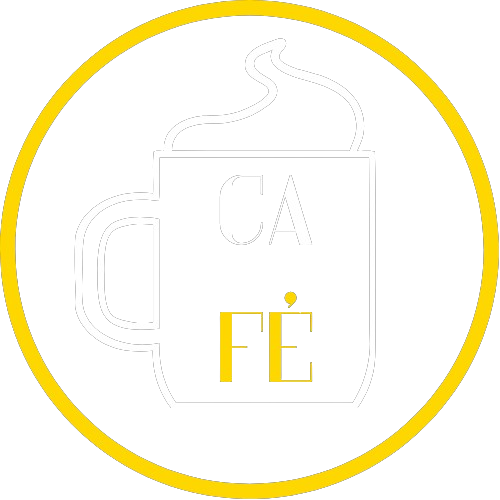

  

<h1 align="center">Ca-FÉ</h1>

Bem-vindo ao Ca-FÉ, um projeto de website para uma loja fictícia especializada em personalização de canecas em alta qualidade 

📜 Descrição
O Ca-FÉ é uma aplicação web que visa proporcionar uma experiência única aos amantes de café, Caneca e FÉ. Nossa missão é transformar canecas em obras de arte personalizadas, criando momentos memoráveis a cada gole.
  

🚀 Funcionalidades
Página Inicial (Home): Apresenta uma breve descrição do Ca-FÉ e destaca a mensagem inspiradora: "Porque vivemos pela fé e não pelo que vemos".
  
Sobre (About): Oferece informações detalhadas sobre a filosofia do Ca-FÉ, o trabalho de personalização.
  
Menu: Apresenta o catálogo de produtos oferecidos pelo Ca-FÉ, incluindo descrições detalhadas de cada opção e os respectivos preços.
  
Rodapé (Footer): Contém informações de contato, detalhes de direitos autorais e créditos de desenvolvimento.
  
💻 Tecnologias Utilizadas  
HTML5  
CSS3  
JavaScript  
🛠️ Instalação e Uso
Clone este repositório: git clone https://github.com/seu-usuario/nome-do-repositorio.git
Navegue até o diretório do projeto: cd nome-do-repositorio
Abra o arquivo index.html em seu navegador preferido.  
🤝 Contribuição
Contribuições são bem-vindas! Sinta-se à vontade para abrir um problema (issue) ou enviar um pull request com suas sugestões de melhorias.

📄 Licença
Este projeto está licenciado sob a MIT License.

  
Made with ☕ by Patrick Souza

